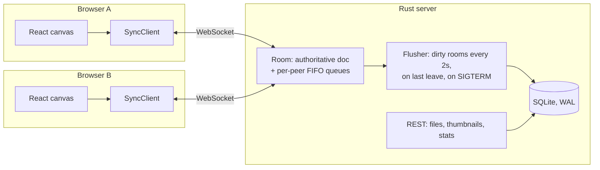

# Tessera

A real-time multiplayer design canvas. Several people edit the same file at once, see each
other's cursors and selections live, and always end up with an identical document.

**Rust** (Axum, Tokio, SQLite) authoritative sync server · **TypeScript** (React) canvas client ·
one binary serves the API, WebSockets, and the built frontend.

```
cargo run (server/)  +  npm run dev (web/)  →  http://localhost:5173
```

Open a file in two windows, or press **Add demo bot** to invite a scripted collaborator that
connects over its own WebSocket and edits alongside you.

---

## Features

- **Live multiplayer**: shapes, text (streamed as you type), freehand pen strokes, moves,
  resizes, recolors, and layer reordering sync to everyone in the file.
- **Presence**: named, colored cursors, remote selection outlines with name tags, an avatar
  stack, and "Find" to jump to a collaborator.
- **Offline tolerance**: keep editing through a disconnect. Unacknowledged edits replay
  automatically on reconnect (exponential backoff with jitter).
- **Per-user undo/redo** that only reverts *your* changes, never a teammate's.
- **Editor**: pan/zoom (trackpad pinch), marquee and shift selection, 8-handle resize with
  aspect lock, drag-to-reorder layers, scrubbable numeric fields, duplicate, copy/paste
  across files, keyboard shortcuts.
- **File browser** with server-rendered SVG thumbnails, a live "N editing now" indicator,
  rename, and delete (open sessions are notified and closed).

## Architecture



A document is a flat map of `node id → properties`. Every edit is one of three ops:
`create`, `set` (merge properties, `null` deletes a key), and `del`. The server applies ops in
arrival order, so the last write to a `(node, property)` pair that reaches the server wins.
Two people editing *different* properties of the same shape both keep their changes. This
is the model Figma describes for its own multiplayer. It's simpler than a CRDT and a good fit
when a server is always in the loop.

### How clients stay converged

This is the core of the project (see [`web/src/sync/client.ts`](web/src/sync/client.ts) and
[`server/src/room.rs`](server/src/room.rs)).

1. **Optimistic edits.** Local ops apply immediately, get batched once per frame (coalesced
   so a 60 fps drag sends one `set` per frame), and are sent with a sequence number.
2. **One ordered channel per peer.** Every outbound message for a peer goes through a single
   FIFO queue, and all enqueues for a room happen while holding the room lock. So if the server
   applied Alice's batch before Bob's, every peer sees them in that order, including Bob, who
   gets Alice's ops *before* the `ack` for his own batch.
3. **Confirmed state + pending replay.** The client keeps `confirmed` (what the server has
   applied) and draws `confirmed + unacknowledged local ops`. When a remote op arrives, it's
   applied to `confirmed` and only the touched nodes are re-derived by replaying pending ops
   on top. When an `ack` arrives, that batch moves into `confirmed` and nothing visibly
   changes. By point 2, this always equals what the server will end up with.
4. **Reconnect = rebase + replay.** On reconnect the server sends a fresh snapshot; the
   client rebases onto it and resends every unacknowledged batch. `create`, `set`, and `del`
   are idempotent, so replaying a batch the server already applied is harmless.
5. **Atomic rejects.** The server validates a whole batch (id length, property limits,
   5,000-node cap) before applying any of it. A bad batch gets `reject` plus an authoritative
   `snapshot`, so the sender's optimistic state can't drift.

An earlier version suppressed remote writes to keys with pending local writes. The randomized
convergence test below found a divergence (a remote `del` racing a local `create`), which is
what led to the confirmed/pending design.

### Other decisions worth knowing

| Concern | Approach |
|---|---|
| Z-order | Fractional index keys (`keyBetween(a, b)`), so moving a layer is one property write on one node, with no renumbering and no conflicts beyond an id tiebreak. |
| Undo | Each step stores **inverse ops** computed from the pre-edit state. Continuous gestures (drag, resize, scrub) snapshot at the start and record one step at the end. |
| Slow consumers | Outbound queues are bounded (1,024). A peer that falls behind is evicted instead of growing server memory; it reconnects and gets a snapshot. |
| Fan-out cost | Each broadcast is serialized to JSON once; the per-peer copies are reference-counted `Bytes`. |
| Persistence | In-memory room is the live copy. Dirty rooms flush every 2s, on last leave, and on SIGINT/SIGTERM. A per-room save lock stops an older snapshot from overwriting a newer one. |
| Thumbnails | Rendered as SVG on the server from the live room (or SQLite), with attribute-safe colors and escaped text. |

## Performance

Measured with [`bench/load.mjs`](bench/load.mjs) against the release build on one MacBook
(load generator and server on the same machine, loopback). Each client sends one
`set` batch at a fixed rate; latency is send → delivered to another client.

| Scenario | Fan-out msgs/s | p50 | p99 | Delivered |
|---|---:|---:|---:|---|
| 1 room × 50 clients × 20 Hz | 48,000 | 4.3 ms | 9.0 ms | 480,200 / 480,200 |
| 1 room × 100 clients × 20 Hz | 194,000 | 6.0 ms | 14.5 ms | 1,940,400 / 1,940,400 |
| 20 rooms × 10 clients × 30 Hz | 52,900 | 3.1 ms | 5.9 ms | 529,200 / 529,200 |

Zero evictions across 3M+ messages. Server RSS stayed around 38 MB. Client bundle is 90 KB
gzipped.

## Testing

```
cd server && cargo test          # 29 tests
cd web && npm test               # 26 tests
```

- **Randomized convergence test**: 60 seeded trials × 300 steps with three clients and an
  in-memory server; every step randomly edits, flushes, processes, or delivers one message,
  covering arbitrary network interleavings. All clients must equal the server at the end.
- **WebSocket integration tests** on a real server/port: ack-before-broadcast ordering,
  strictly increasing versions under 50 conflicting concurrent writes, presence relay,
  atomic reject + snapshot, persistence after the last peer leaves, delete kicks
  connected peers, rename broadcast.
- Unit tests for op semantics and validation limits, slow-peer eviction, SQLite store,
  SVG thumbnail escaping, fractional indexing, undo inversion, and resize geometry.
- CI runs `cargo fmt --check`, `clippy -D warnings`, `cargo test`, `tsc`, `vitest`, and a
  production build.

## Running

**Development** (hot reload; Vite proxies `/api` and `/ws` to the server):

```bash
cd server && cargo run          # :8787, creates tessera.db with a welcome file
cd web && npm install && npm run dev   # :5173
```

**Production** (one binary serves everything):

```bash
cd web && npm run build
cd server && cargo run --release        # http://localhost:8787
```

**Docker:**

```bash
docker build -t tessera .
docker run -p 8787:8787 -v tessera-data:/data tessera
```

Configuration: `PORT` (8787), `TESSERA_DB` (`tessera.db`), `TESSERA_STATIC` (`../web/dist`),
`RUST_LOG`.

## Layout

```
server/src/
  doc.rs        document model, op semantics, validation
  room.rs       rooms, ordering, fan-out, backpressure, flushing
  protocol.rs   wire messages
  api.rs        REST routes + WebSocket session loop
  store.rs      SQLite persistence
  thumbnail.rs  SVG thumbnails
server/tests/   end-to-end WebSocket tests
web/src/sync/   SyncClient, protocol types, fractional indexing (+ tests)
web/src/editor/ canvas, gestures, panels, undo history, demo bot
web/src/dashboard/ file browser
bench/          load generator
```

## Limitations and next steps

- **Single node.** Rooms live in one process. Scaling out means routing each document to
  one owner (consistent hashing on doc id) with a directory service for handoff.
- **Snapshots, not an op log.** Saving whole documents is simple and fine at this size; an
  append-only op log would add history/versioning and cheaper writes for large files.
- **No auth.** Anyone with a link can edit. Real deployments need accounts and per-file
  permissions checked at WebSocket upgrade.
- Text editing is last-writer-wins on the whole string; concurrent typing in the *same*
  text box would need a sequence CRDT for that property.
